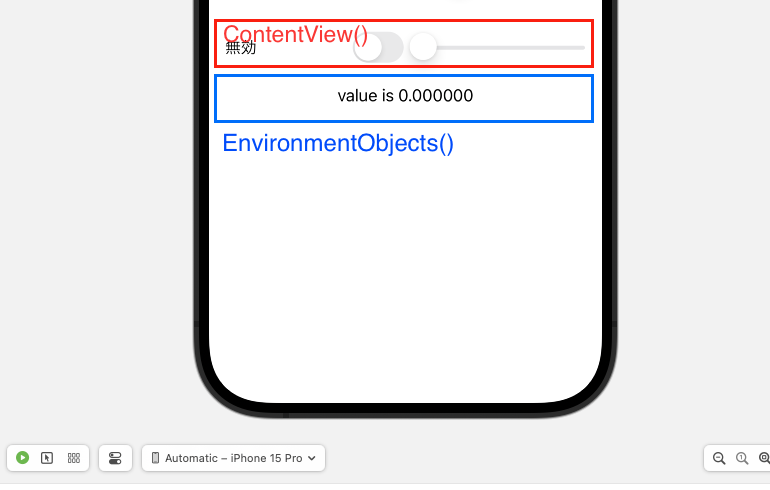

# @State, @ObservedObject, @EnvironmentObjectについて

Swiftでプロパティの先頭につける<b>@State、@ObservedObject、@EnvironmentObject</b>のようなものは、一般的に「プロパティラッパー（Property Wrapper）」と呼ばれます。これらはプロパティの値を保持したり、値の変更を監視したりするのに使用されます。
このディレクトリ内では、3つのプロパティラッパーについて動きを確認していきたいと思います。


## @EnvironmentObjectの挙動について
まずEnvironmentとは、「環境」といった意味になります。
@observedObjectと同様に、複数の値の状態管理を行う際に@EnvironmentObjectを定義します。
@EnvironmentObjectの特徴はアプリ全体で共通のプロパティとなります。

以下のswift文で変数の動きを確認してみます。
* @EnvironmentObjectの宣言文
  1. クラスに定義したモデルに ObservableObjectのプロトコルを準拠させる。
   <br>※クラスの参照型の性質を使っている。
  2. クラス内で監視する変数には@Publishedを付ける。
  3. 更新をかけた変数がViewで扱えるようにするためには、@EnvironmentObject 以降にObservedFugaモデルクラスのインスタンスを監視するためのプロパティを定義します。
  4. 全体でプロパティが共有されるかどうかを確認するために、新しくswiftスクリプトを準備し、3.と同様に定義します。
```swift
<!-- ObservableModel.swift -->
import SwiftUI

class ObservedFuga : ObservableObject {
    @Published var isObservEnabled : Bool = false
    @Published var value = 0.0
}


<!-- ContentView.swift -->
struct ContentView: View {

    @State private var isStateEnabled : Bool = false
    @ObservedObject var object: ObservedFuga
    @EnvironmentObject var objects: ObservedFuga

        
    var body: some View {
        VStack {
            HStack{
                Toggle(isOn: self.$objects.isObservEnabled) {
                                Text("無効")
                            }
                            Slider(value: self.$objects.value, in: 0...100)
                        }
            .padding()
            }
        }
    }
    #Preview {
    ContentView(object: ObservedFuga())
//    environmentObject定義した時に以下を書き込む必要がある
        .environmentObject(ObservedFuga())
}

<!-- EnvironmentObject.swift -->
struct EnvironmentObjects: View {
    @EnvironmentObject var environment: ObservedFuga

        var body: some View {
            Text("value is \(self.environment.value)")
        }
    }


#Preview {
    EnvironmentObjects()
        .environmentObject(ObservedFuga())
}
```
上記で記述したコーディングは以下のようなViewになっています。

<b>[結果] </b>
以下の動画より、別々のViewで定義したプロパティが共有されていることが確認できます。



## 実験
#### 実験1  : @observedObjectでプロパティが全体で共有できないことを確認する。

@observedObjectと@EnvironmentObjectの違いを確認するため、@observedObjectでプロパティが全体で共有できないことを確認します。

```swift
<!-- ObservableModel.swift -->
import SwiftUI

class ObservedFuga : ObservableObject {
    @Published var isObservEnabled : Bool = false
    @Published var value = 0.0
}


<!-- ContentView.swift -->
struct ContentView: View {

    @State private var isStateEnabled : Bool = false
    @ObservedObject var object: ObservedFuga
    @EnvironmentObject var objects: ObservedFuga

        
    var body: some View {
        VStack {
            HStack{
                Text(isStateEnabled ? "有効" : "無効")
                    .padding()
                Toggle("", isOn: self.$object.isObservEnabled)
                    .padding()
                //            onchangeモディファイアのofの引数には監視対象となるプロパティを記入する
                    .onChange(of: object.isObservEnabled){
                        print("isStateEnabledの状態:\(object.isObservEnabled)")

                    }
                Slider(value: $object.value, in: 0...100)
//                トグルボタンを押してisObservEnabledがTrueになった時に画面値が表示される
                if (self.object.isObservEnabled ){
                                Text("Value is \(self.object.value)")
                            }
            }
            }
        }
    }
    #Preview {
    ContentView(object: ObservedFuga())
//    environmentObject定義した時に以下を書き込む必要がある
        .environmentObject(ObservedFuga())
}

<!-- subObservedObject.swift -->
struct subObservedObject: View {
    @ObservedObject var object: ObservedFuga

            var body: some View {
                Text("value is \(self.object.value)")
            }
    }

#Preview {
    subObservedObject(object: ObservedFuga())
}


#Preview {
    EnvironmentObjects()
        .environmentObject(ObservedFuga())
}

<!-- subObservedMain.swift -->
struct subObservedMain: View {
    @ObservedObject var object: ObservedFuga
    var body: some View {
        VStack {
            ContentView(object: ObservedFuga())
            subObservedObject(object: ObservedFuga())
        }
    }
}

#Preview {
    subObservedMain(object: ObservedFuga)
}

```

<b>[結果] </b><br>クラッシュしてしまい全体で共有できるかどうかを判定することはできませんでした。
errorが出たということは、全体でデータを共有したい場合は、@EnvironmentObjectを宣言して使用してあげればいいことがわかりました。
