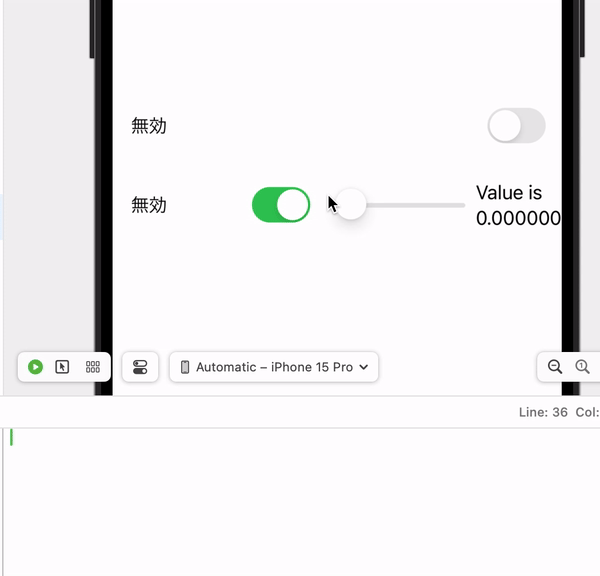

# @State, @ObservedObject, @EnvironmentObjectについて

Swiftでプロパティの先頭につける<b>@State、@ObservedObject、@EnvironmentObject</b>のようなものは、一般的に「プロパティラッパー（Property Wrapper）」と呼ばれます。これらはプロパティの値を保持したり、値の変更を監視したりするのに使用されます。
このディレクトリ内では、3つのプロパティラッパーについて動きを確認していきたいと思います。


## @observedObjectの挙動について
まずobservableとは、「観察可能な」といった意味になります。
@stateとは違い、複数の値の状態管理を行う際は@observedObjectを定義します。

以下のswift文で変数の動きを確認してみます。
* @observedObjectの宣言文
  1. クラスに定義したモデルに ObservableObjectのプロトコルを準拠させる。
   ※クラスの参照型の性質を使っている。
  2. クラス内で監視する変数には@Publishedを付ける。
  3. 更新をかけた変数がViewで扱えるようにするためには、@ObservedObject 以降にObservedFugaモデルクラスのインスタンスを監視するためのプロパティを定義します。
```swift
<!-- ObservableModel.swift -->
import SwiftUI

class ObservedFuga : ObservableObject {
    @Published var isObservEnabled : Bool = false
    @Published var value = 0.0
}


<!-- ContentView.swift -->
struct ContentView: View {

    @State private var isStateEnabled : Bool = false
    @ObservedObject var object: ObservedFuga


    var body: some View {
        VStack {
            HStack{...stateの内容}
            }
            HStack{
                Text(isStateEnabled ? "有効" : "無効")
                    .padding()
                Toggle("", isOn: self.$object.isObservEnabled)
                    .padding()
                //            onchangeモディファイアのofの引数には監視対象となるプロパティを記入する
                    .onChange(of: object.isObservEnabled){
                        print("isStateEnabledの状態:\(isStateEnabled)")

                    }
                Slider(value: $object.value, in: 0...100)
//                トグルボタンを押してisObservEnabledがTrueになった時に画面値が表示される
                if (self.object.isObservEnabled ){
                                Text("Value is \(self.object.value)")
                            }
            }
        }
    }
```
上記で記述したコーディングは以下のようなViewになっています。

<b>[説明] </b>
if文でトグルボタンがTrueになると値が表示されます。
SwiftUIのビューがObservedFugaクラスのインスタンスを監視し、ビュー上のスライドの値が変わるとそのインスタンスのプロパティが変更されビューを更新し再描写します。


