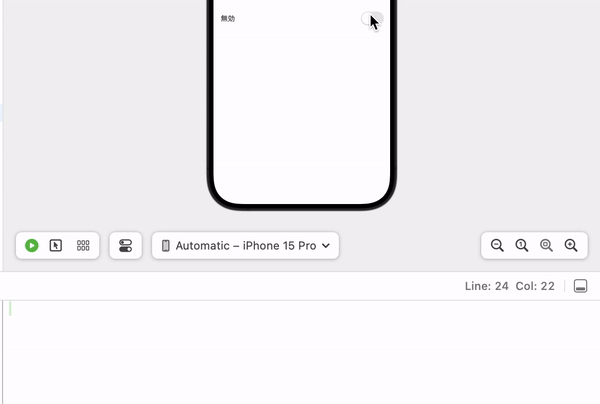

# @State, @ObservedObject, @EnvironmentObjectについて

Swiftでプロパティの先頭につける<b>@State、@ObservedObject、@EnvironmentObject</b>のようなものは、一般的に「プロパティラッパー（Property Wrapper）」と呼ばれます。これらはプロパティの値を保持したり、値の変更を監視したりするのに使用されます。
このディレクトリ内では、3つのプロパティラッパーについて動きを確認していきたいと思います。


## @Stateの挙動について
structで定義する変数は通常値を更新することができません。
変数を監視して、変更に応じてViweを再描写してくれるプロパティーラッパーが、@stateになります。
基本、@stateを宣言したプロパティのView内でしかアクセスができません。

以下のswift文で変数の動きを確認してみます。
* @stateの宣言文
```swift
struct ContentView: View {

    @State var isStateEnabled : Bool = false

    var body: some View {
        VStack {
            HStack{
                Text(isStateEnabled ? "有効" : "無効")
                    .padding()
                Toggle("", isOn: $isStateEnabled)
                    .padding()
                //            onchangeモディファイアのofの引数には監視対象となるプロパティを記入する
                    .onChange(of: isStateEnabled){
                        print("isStateEnabledの状態:\(isStateEnabled)")
                    }
            }
        }
    }
}
```
上記で記述したコーディングは以下のようなViewになっています。


写真にあるtogleボタンを押すことで、変数（isStateEnabled）がtrueになったりfalseになったりして更新されていることが確認できます。



## 実験
#### 実験1  : @Stateプロパティに外部からアクセスする
structで定義された@Stateプロパティに外部からアクセスしようとするとどうなるかを確認します。

```swift
struct Outside {
    print(isStateEnabled)
}
```

新しく構造体を構築し、そこからViewで@Stateを定義した変数にアクセスしてみると、このスコープ（範囲）からisStateEnabledの変数を見つけることができないといったエラーが生じました。
```
Canot find type 'isStateEnabled' in scope
```